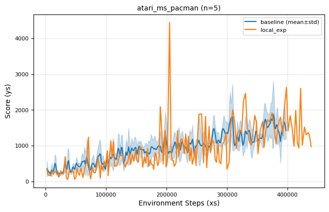
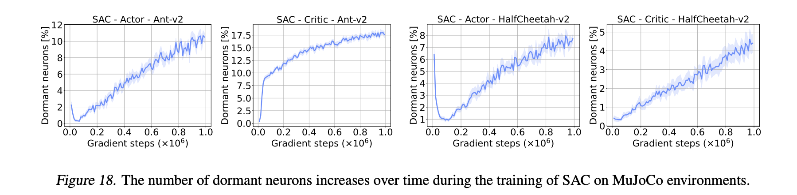
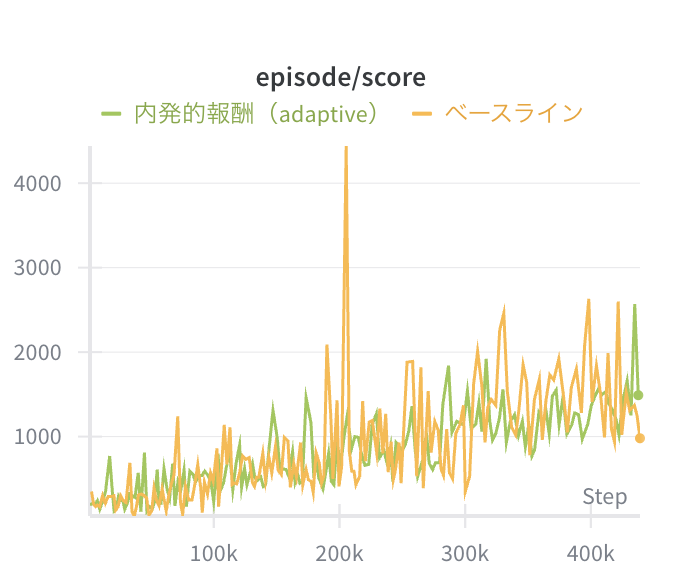
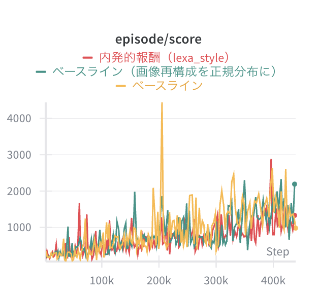
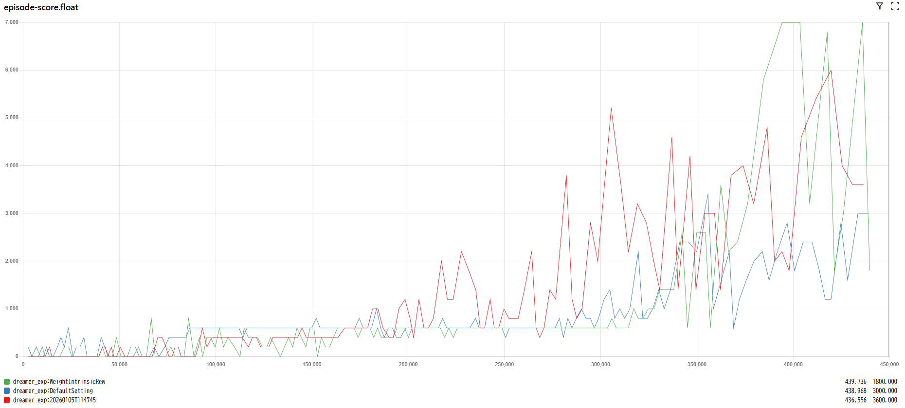
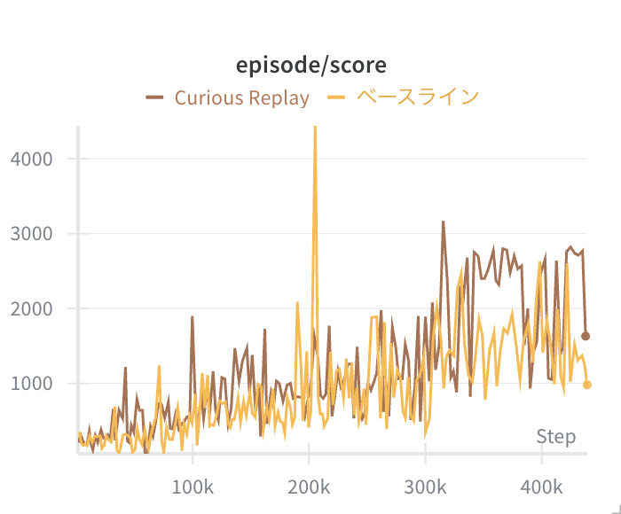
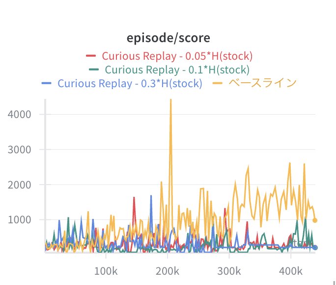
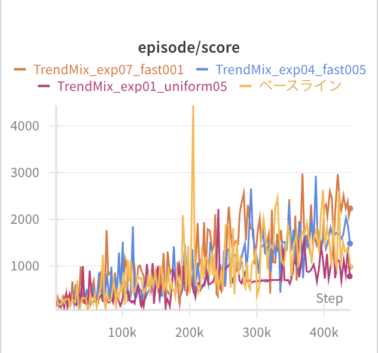

# 実験結果

Ms. Pac-Man における実験結果のまとめである。実験に使用したスクリプトは `exp_script` ディレクトリに配置されている。

---

## 1. ベースライン実験の再現

**スクリプト:**
- [`exp_script/251226_run_mspackman_dormat.sh`](exp_script/251226_run_mspackman_dormat.sh)

### 仮説

- [DreamerV3](https://arxiv.org/abs/2301.04104) 論文のハイパーパラメータを用いて実験を再現する

### 結果

#### 報酬

- 論文で提示されている性能と概ね一致した



#### 休眠ニューロン計測 (Dormant Neuron Monitoring)

- 今回の全ての実験では、[休眠ニューロン](https://arxiv.org/abs/2302.12902)の割合を計測し、学習の進捗やネットワークの健全性の目安とした


**実装:** [`dreamerv3/dormant.py`](dreamerv3/dormant.py)

休眠ニューロンの判定は以下の数式に基づく：

```
s_i = mean_abs_activation_i / layer_mean
dormant if s_i ≤ τ (default τ = 0.025)
```

World Model（encoder, RSSM, decoder）、Actor、Critic の各層について休眠ニューロンの割合を計測している。

### 考察

- 論文実装の再現ができた
- 休眠ニューロンの割合は低く保たれており、これが世界モデルが成功している要因である可能性がある
- 【参考】ハイパーパラメータ・タスクなど異なるため単純な比較はできないが、単純な SAC では休眠ニューロンの増加が報告されている（[The Dormant Neuron Phenomenon in Deep Reinforcement Learning](https://arxiv.org/abs/2302.12902) より）



---

## 2. 内発的報酬 (Intrinsic Reward)

### 2.1 適応的内発的報酬 (Adaptive Intrinsic Reward)

**スクリプト:**
- [`exp_script/251229_run_mspackman_intrinsic.sh`](exp_script/251229_run_mspackman_intrinsic.sh)

**実装:** [`dreamerv3/intrinsic.py`](dreamerv3/intrinsic.py) - `AdaptiveIntrinsicReward` クラス

内発的報酬は以下の数式で計算される：

```
r_explore = Std(s')                    # 状態の不確実性（探索ボーナス）
r_exploit = 1 / (Std(s') + ε)          # 状態の確実性（活用ボーナス）

gate_exploit = ReLU(dr - dr_prev)      # 報酬が加速 → 活用
gate_explore = ReLU(dr_prev - dr)      # 報酬が減速 → 探索

r_hat = gate_exploit × r_exploit + gate_explore × r_explore
beta = rho × ext_scale / (intr_scale + ε)  # 適応的スケーリング
rew_total = rew_ext + beta × r_hat
```

#### 仮説

- 報酬が上がっているときは活用を促進し、報酬が下がっているときは探索を促進するような内発的報酬を設計
- 探索と活用を必要に応じて自動的に切り替えるような方策の獲得を期待した

#### 結果

- 明確な改善は見られなかった



#### 考察

- stoch（確率的状態）の標準偏差が「知らないこと」に直接対応しない（単純に確率的遷移が多いだけの可能性）
- 報酬の上昇・下降トレンドが頻繁に変化し、報酬が不安定になった可能性
- 報酬が取れたときに探索を狭めるため、局所解に落ちやすい可能性

### 2.2 LEXA型内発的報酬 (LEXA-style Intrinsic Reward)

**スクリプト:**
- [`exp_script/260107_run_mspackman_normal.sh`](exp_script/260107_run_mspackman_normal.sh)
- [`exp_script/260108_run_mspackman_normal_intrinsic.sh`](exp_script/260108_run_mspackman_normal_intrinsic.sh)

**実装:** [`dreamerv3/intrinsic.py`](dreamerv3/intrinsic.py) - `LexaStyleIntrinsicReward` クラス

デコーダの予測不確実性（正規分布の標準偏差）を視覚的好奇心として利用：

```
visual_bonus = decoder_stddev × visual_scale

# EMAベースの報酬トレンド検出
rew_ema = (1 - decay) × rew_ema + decay × rew
rew_grad = rew - rew_ema                # 報酬の変化率

weight_upper = clip(rew_grad, 0, 1)     # 報酬上昇時 → 活用
weight_lower = clip(1 - rew_grad, 0, 1) # 報酬停滞時 → 探索

total_rew = weight_upper × rew_ext + weight_lower × visual_bonus
```

#### 仮説

- [Discovering and Achieving Goals via World Models](https://arxiv.org/abs/2110.09514) (Mendonca et al., ICML 2021) の論文で用いられている内発的報酬を使用した
- 実装の関係で、画像再構成を正規分布にする必要があったため、この変更の有無についても実験した

#### 結果

- Ms. Pac-Man では明確な改善は見られなかった



- Frostbite では画像再構成を正規分布にすると大幅に報酬が増加する現象がみられた



#### 考察

- タスクによっては、画像再構成を正規分布にすると大幅に報酬が増加する現象がみられた
- 画像再構成と他の誤差のバランスには最適化の余地がある可能性がある

---

## 3. リプレイサンプリング戦略 (Replay Sampling Strategies)

これらの手法は学習データの分布を変化させるため、広義の内発的動機付けとみなすことができる。

### 3.1 Curious Replay（サンプリング戦略のベースライン）

**スクリプト:**
- [`exp_script/251229_run_mspackman_curious.sh`](exp_script/251229_run_mspackman_curious.sh)

**実装:** [`embodied/core/selectors.py`](embodied/core/selectors.py) - `CuriousReplay` クラス

優先度は以下の数式で計算される：

```
priority = c × β^visit_count + (model_loss + ε)^α
```

- `c × β^visit_count`: 訪問頻度の低い経験を優先（カウントベース項）
- `(model_loss + ε)^α`: 予測困難な遷移を優先（損失ベース項）

デフォルトパラメータ: `c=1e4, β=0.7, α=0.7, ε=0.01`

#### 仮説

- [Curious Replay for Model-based Adaptation](https://arxiv.org/abs/2306.15934) (Kauvar et al., ICML 2023) の論文を再現する

#### 結果

- 多少の改善が見られた



#### 考察

- Curious Replay の論文を再現することができた
- 大差ではないため、複数 seed での実験を行うべき

### 3.2 Curious Replay（エントロピー調整）

エントロピー調整（`H(stoch)`）を有効にした Curious Replay の比較結果である。

**スクリプト:**
- [`exp_script/251230_run_mspackman_curious.sh`](exp_script/251230_run_mspackman_curious.sh)
- [`exp_script/251231_run_mspackman_curious.sh`](exp_script/251231_run_mspackman_curious.sh)

**実装:** [`embodied/core/selectors.py`](embodied/core/selectors.py) - `CuriousReplay` クラス（`entropy_lambda` パラメータ）

エントロピー調整を加えた優先度計算：

```
adjusted_loss = max(model_loss - λ × entropy(stoch), 0)
priority = c × β^visit_count + (adjusted_loss + ε)^α
```

`λ > 0` に設定すると、確率的状態のエントロピーが高い（＝環境のノイズに起因する）遷移の優先度を下げる。

#### 仮説

- 確率的状態のエントロピー（H(stoch)）は、学習の本質的な難しさ（確率的遷移の多様性）を表しているのではないかと考えた
- Curious Replay において、Noisy TV problem を避けるために、過度に確率的状態のエントロピー（H(stoch)）が高いエピソードばかりがサンプリングされるのを防止するべき
- そこで、確率的状態のエントロピー（H(stoch)）を model loss から引いた指標を用いることで、モデルが本質的に未学習な状態を優先して学習できるのではないかと考えた

#### 結果

- 全てのハイパーパラメータにおいて、報酬の悪化が見られた



#### 考察

- 確率的状態のエントロピー（H(stoch)）は、特に序盤では未学習を表す可能性がある
- そのような未学習な状態の学習を抑制してしまった可能性がある

### 3.3 探索/活用バランシング (TrendMixture)

報酬のトレンドに基づいて探索と活用をバランスさせる手法である。

**スクリプト:**
- [`exp_script/260104_run_mspackman_trendmix_multi.sh`](exp_script/260104_run_mspackman_trendmix_multi.sh)
- [`exp_script/260105_run_mspackman_trendmix_multi.sh`](exp_script/260105_run_mspackman_trendmix_multi.sh)
- [`exp_script/260106_run_mspackman_trendmix_multi.sh`](exp_script/260106_run_mspackman_trendmix_multi.sh)

**実装:**
- [`embodied/core/selectors.py`](embodied/core/selectors.py) - `TrendMixture` クラス
- [`embodied/core/replay.py`](embodied/core/replay.py) - `_update_trend` メソッド
- [`dreamerv3/agent.py`](dreamerv3/agent.py) - 優先度計算（KL divergence）

探索・活用の優先度とゲート計算：

```
# 優先度計算（agent.py）
explore_priority = KL(posterior || prior)     # 不確実性が高い → 探索
exploit_priority = 1 / max(KL, ε)             # 不確実性が低い → 活用

# トレンド検出（replay.py）
trend_fast_ema = (1 - fast) × trend_fast_ema + fast × episode_return
trend_slow_ema = (1 - slow) × trend_slow_ema + slow × episode_return
trend = trend_fast_ema - trend_slow_ema

# 加速度に基づくゲート計算
accel = trend - trend_prev
gate = sigmoid(k × accel)                     # 加速 → exploit, 減速 → explore
gate = clip(gate, gate_min, gate_max)

# サンプリング比率
explore_frac = trend_total × (1 - gate)
exploit_frac = trend_total × gate
```

#### 仮説

- 長期的な報酬の上がり方に応じて、リプレイバッファからのサンプリングを工夫することで精度向上につながるのではないか
- 報酬の加速度が上がっているときはすでに学習したデータを中心に学習を深め、報酬の加速度が下がっているときは新しいデータを多く取り込むようにすることで、学習の高速化や必要な探索の深化を期待した

#### 結果



#### 考察

- DreamerV3 についてはランダムサンプリングが想像以上に強い
- サンプリング方法の切り替えを加速度で行うのではなく、速度（報酬が上昇しているかどうか）で切り替えてもよかったかもしれない

---

## 参考文献

- [DreamerV3: Mastering Diverse Domains through World Models](https://arxiv.org/abs/2301.04104) (Hafner et al., Nature 2025)
- [LEXA: Discovering and Achieving Goals via World Models](https://arxiv.org/abs/2110.09514) (Mendonca et al., ICML 2021)
- [Curious Replay for Model-based Adaptation](https://arxiv.org/abs/2306.15934) (Kauvar et al., ICML 2023)
- [The Dormant Neuron Phenomenon in Deep Reinforcement Learning](https://arxiv.org/abs/2302.12902) (Sokar et al., ICML 2023)
